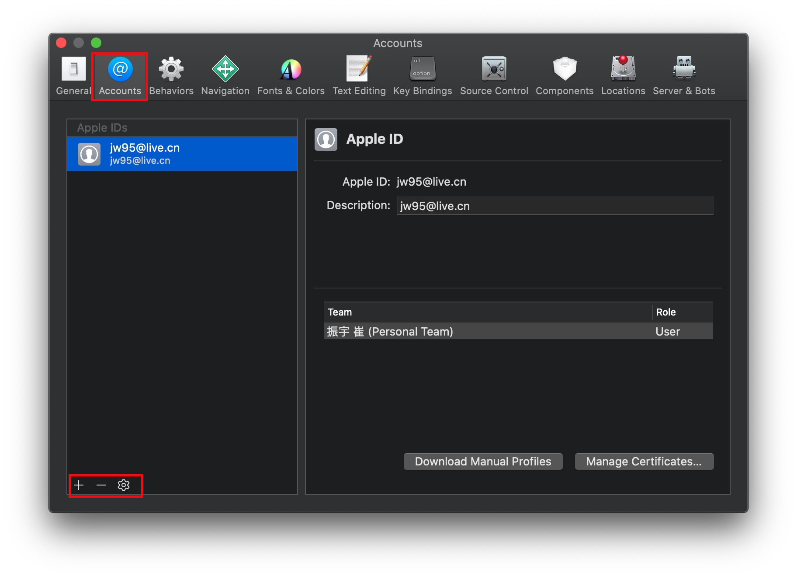
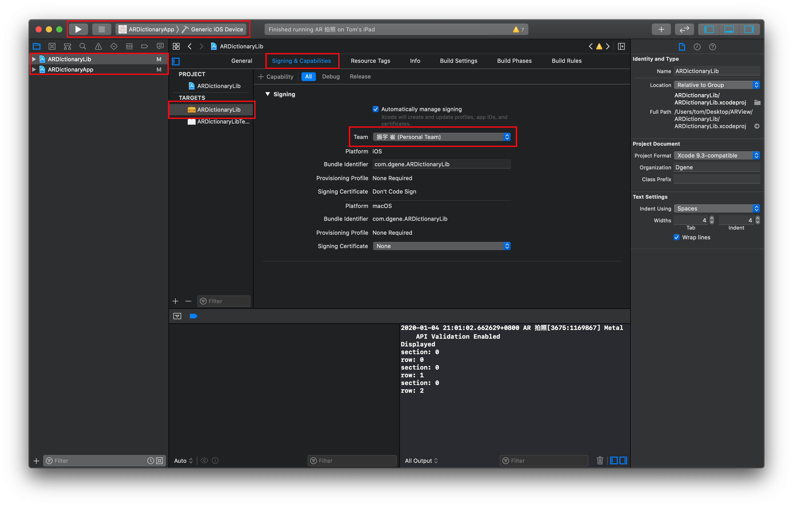
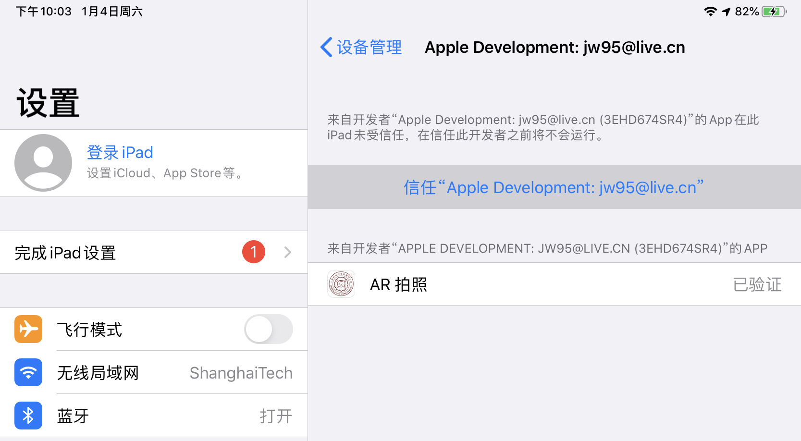
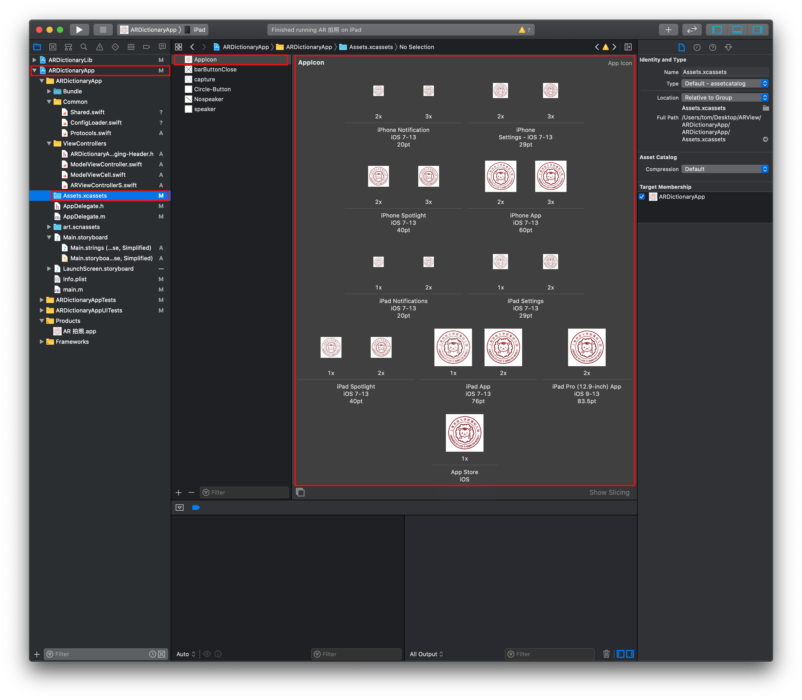
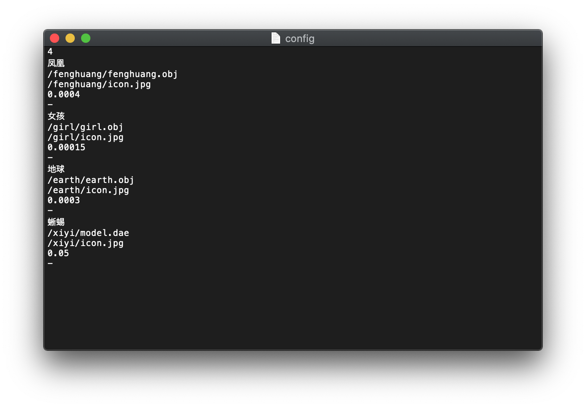

# AR 拍照

## 部署方法
- 用 Xcode 打开 ARDictionary.xcworkspace 。在菜单中选择 Xcode -> Preferences -> Accounts，添加 Apple ID 来给应用签名。

- 选择左侧蓝色图标的 “ARDictionaryLib” 在右侧窗口中的 Signing & Capabilities 中的 “Team” 选项中，选择对应的 Apple ID。然后对“ARDictionaryApp”进行同样的操作。
- 连接设备，在设备端上输入密码信任电脑的 USB 操作。在 Xcode 窗口的左上角选择对应的设备，然后点击▶️安装到设备上。

- 如果应用未能启动，请将 iOS 设备连接到网络，打开 设置 -> 通用 -> 设备管理，选择开发者证书并信任该开发者。

## 更换 Logo 的办法
- 在左侧 ARDictionaryApp 中选择 Assets.xcassets -> AppIcon，便能看到当前 App 需要的图标组合。

- 其中 pt 代表的是点数，与真实像素值之间有缩放倍数的差异，请根据上面显示的要求来准备对应的正方形图标，不要带有透明通道。以 iPhone App iOS 7-13 60pt 为例，对于 2x 图标，需要准备的是像素为 120x120，PPI 为 144 的图标；对于 3x 图标，需要准备的是像素为 180x180，PPI 为 216 的图标。
- 图片 PPI 属性与缩放倍数的关系
	- 1x：72
	- 2x：144
	- 3x：216
- 准备好图标后，将 Finder 中的图片文件拖拽到对应的位置即可。

## 更改模型的办法

- 在 Finder 中打开 ARDictionaryApp/Bundle/config.txt ，通过更改该文件来控制 App 中显示的模型。

- config.txt 文件格式
	- 第一行代表模型的数量
	- 对于每一个模型，都有 5 行数据可以提供对应功能。
		- **凤凰**
		- // 模型在 App 中显示的名称
		- **/fenghuang/fenghuang.obj** 
		- // 模型的路径，相对于 Bundle 文件夹的路径。
		- **/fenghuang/icon.jpg**
		- 模型的图标路径，相对于 Bundle 文件夹的路径。
		- **0.0004**
		- // 模型的缩放因子，模型在 ARView 里面会事先缩放相应的比例。
		- **-**
		- 这一行是预留给之后的可能会使用的数据的，目前没什么用，所以写什么都行但是必须得有这一行。
	- 每一个模型都以该格式不断往下写。	
- 将对应的模型文件放到 Bundle 文件夹中，下次安装的时候会自动拷贝。
- SceneKit 支持的模型格式
	- *.obj
	- *.ply
	- *.scn，SceneKit 场景文件，支持动画
	- *.dae，支持动画
		- 对于 dae 文件，需要使用 Xcode 打开 dae 文件，在菜单中选择 Editor -> Convert to SceneKit file format (.scn)，将文件转换成 scn 之后使用。
	